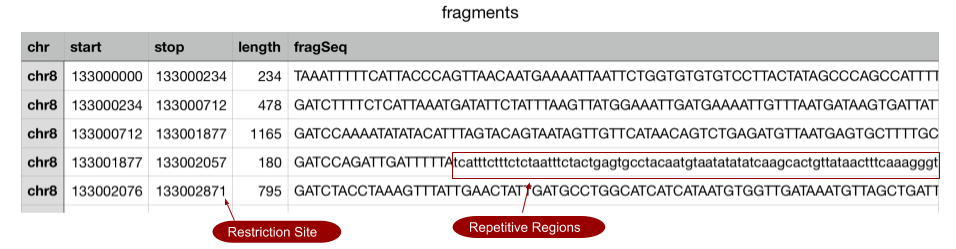

# LURE (Command-Line)
***********************


[Lure](https://opal.ils.unc.edu/~esdavis/final_project/lure_project/) is a responsive, intuitive dashboard for visualizing probe design.

### Abstract
***********************

Often, molecular biologists are in-the-dark about the quality of synthetically designed oligonucleotide probes. However, ensuring that probes are designed to achieve the best enrichment possible is a desirable goal. This is traditionally done through an intensive trial-and-error process, costing a great deal of time and money. To ensure a high degree of enrichment a priori, we propose Lure, a probe visualization platform for assessing probe quality before spending time and money on an experimental approach. Lure allows for quality assurance of synthetically designed probes by allowing users to inspect overall probe coverage as well as summary statistics for whole or subset data. Using the incredible D3 library, this visualization tool will provide a responsive and intuitive dashboard which will improve the workflow for oligonucleotide probe design.


### Motivation
**********************

The human genome is a long string of DNA made up of 4 nucleotides: A,T,C, and G. This long string is enormous, taking up about 3.2Gb of storage. However during biological experiments, we may only be interested in examining a small (say 2Mb) portion of this 3.2Gb genome. While it is possible to look at the whole 3.2Gb genome at once, this is very expensive and often logistically not feasible.

To address this, we design oligonucleotide probes. Oligonucleotide probes are small (120bp) segments of DNA that can attach to various places on the region that we are interested in. We can use these probes to attach to our region of interest, and extract only that portion from the large 3.2Gb pool. This allows biologists to ask and answer a variety of useful questions, such as 1) how does a certain cancer occur or 2) who is at risk for developing alzheimer's?

However, designing these probes is a non-trivial process. There are many characteristics about DNA sequences that make probes more or less likely to be extracted successfully. To extract DNA, it first needs to be chopped into pieces using restriction enzymes - or molecular scissors that cut DNA at specific sites. These locations, also known as restriction sites, are the best places to design probes. In addition to cutting up DNA, the probes must successfully identify the region and attach or hybridize to it. The genome is actually full of repetitive sequences (segments of DNA that are duplicated in different locations). Because of this, it is advantageous to avoid designing probes that target these highly repetitive regions. Finally, the nucleotide content can affect a probes ability to bind to DNA. Specifically, AT segments bind more weakly than GC segments. Therefore, it is advantageous to target probes to DNA regions that have an balanced AT/GC content.

New probe design protocols are being created every year as scientists discover new ways of investigating the genome. However, there is a lack of high quality tools for visualizing, and closely examining the results of these design processes before spending time and money testing them out. While the design of these probes is beyond the scope of this project, we have built a responsive, intuitive dashboard for visualizing probe design results. It incorporates several probe design characteristics such as restriction enzyme sites, repetitive regions, GC content, and other quality metrics to examine probe design results in an intuitive user-guided manner.

### Data
**********************

For this project, we used probes designed with existing software (by Eric Davis and members of the Phanstiel lab). These probes were designed for hybrid-capture Hi-C (Hi-C2). In short, this technique allows a molecular biologist to gain information about the 3D organization of a genomic region by hybridizing probes to a chimerically joined DNA library which is capable of conveying contact probabilities among a contiguous stretch of DNA. In this probe design method, restriction sites form the junctions where such chimera are found. Characteristics of interest for this method include: the start and stop positions of each probe, the shift or distance from a restriction site, directionality of each probe (upstream or downstream from the restriction site), GC/AT content, sequence, number of repetitive bases in each probe sequence, and quality (via pass number, GC score, and quality score).

We used two csv files containing the information described above. The first dataset (probeData.csv) consists of 14 columns (chr, start, stop, shift, resFragment, dir, AT, GC, seq, pass, repetitive, gcScore, qualityScore, and quality) and 204 rows, were each row represents an oligonucleotide probe and each column represents some dimension or characteristic about each probe (Fig. 1).


Figure 1. First few rows of probeData.csv showing probe-specific information. Preview of probeData.csv. The start and stop positions will be used to construct the probe objects along the x-axis of the region view (described below) while the y-axis can be represented by any other quantitative measure which in this figure is the GC content. The sequence column refers to the nucleotide sequence belonging to each start and stop position.

The second csv file (fragments.csv) contains context-specific information about the targeted region of interest such as the position of each restriction start site and the complete sequence of the region (Fig. 2). For simplicity, we used a third-party program (bedtools) to extract the complete sequence for this region of interest. This was done using these commands in bash:

```
echo 'chr8   133000000  133100000' > temp.bed;
bedtools getfasta -fi genomes/hg19.fa -bed temp.bed
```

Where `genomes/hg19.fa`is the full hg19 build of the human genome. The result of this command is a single string containing the nucleotide sequence for `chr8:133,000,000-133,100,000`, with lowercase letters representing repetitive regions located somewhere in the genome.



Figure 2. First few rows of fragments.csv showing probe-specific information. Preview of fragments.csv. The stop column represents the restriction site positions while the fragSeq column describes the sequence between each restriction site. Lowercase letters represent repetitive regions.

These two data sets along with the string of nucleotides for the region of interest form the basis for our visualization dashboard. Any probe design protocol capable of generating this information is compatible with our software.

### Design Plan and User Experience
**********************

The lure dashboard was designed to contain 3 major components: a region-specific view, summary view, and data view. Together, these components allow the user to explore every aspect of the dataset at all possible levels of detail.


Figure 3. Three major views of the Lure Dashboard. The region view displays probe-specific information in the context of its genomic location. The summary view uses histograms to communicate distributions of probes within the region view. The data view shows all relevant information about each probe within the region view.

The user experience begins with the region view which serves as the driver for the dashboard. Here, the user can visualize probes in the context of their genomic location. The user can use intuitive controls such as panning and zooming to inspect the distribution of probes. The summary view contains histograms which summarize various characteristics about the probes in the region view, such as the distance from the restriction site, GC fraction, base pairs from repetitive regions, and the quality score of probes. The summary view is linked to the region view such that the histograms will update to contain only information about the probes that are currently being viewed. Finally, the dashboard contains a data view. This is the most specific view for the probes, displaying all the available information for each probe. The data view is also linked with the region view, so only probes in the active region view appear in the table. As the user explores the data in the region view, the linked summary and data view simultaneously provide large scale trends, as well as probe specific information (Fig. 3).

### Implementation and Functionality Details
**********************

We implemented our design plan using the D3, simple statistics, dataTables, and jquery javascript libraries with some bootstrap library formatting. According to our design plan we created the region, summary, and data views with a wide array of functionality.

The region view displays each oligonucleotide probe according to its genomic position on the x-axis, colored by its quality designation, and stratified on the y-axis according to GC content (by default). The user can zoom and pan to adjust the number of probes displayed in the region view. To inspect an individual probe, a user can hover over the probe and get details-on-demand in the form of a tooltip with the chromosome, start position, stop position, a slice of the first and last 10 characters of the sequence, GC content percentage, number of repetitive bases, and the quality score (Fig. 4). This allows the user to inspect individual probes for their characteristics while still maintaining location context.


Figure 4. Advanced plotting options for region view. The user can hover over probes to access details-on-demand, zoom in-depth to view surrounding sequence context, and toggle advanced plotting options to see restriction sites and repetitive region highlighting.

In addition to viewing the probes in detail, the user can also inspect how the probes have been designed according to the surrounding context. As the user continues to zoom, the surrounding sequence context begins to appear just above the x-axis (Fig. 4). This provides surrounding context when the user is deeply zoomed without becoming too distracting. Under the advanced plotting options pane, there are additional context markers that can be optionally toggled. Specifically, the user can choose to view restriction sites (as vertical grey lines on the plot) as well as repetitive regions (pink shaded regions) (Fig. 4). This allows the user to assess the quality of their probe design. Users can inspect how close each probe is to the restriction site while avoiding the pink shaded repetitive regions.

By default the y-axis stratifies probes based on their GC content. However, under the advanced plotting options tab the user can choose from a dropdown menu for which characteristic to use for plotting on the y-axis including GC content, AT content (1-GC content), distance from restriction site, number of repetitive bases, or quality score. This allows the user to inspect the distribution of each dimension simultaneously with the genomic location.

As described in the Design Plan and User Experience section, the summary and data views are linked to the region view. As the user navigates through the data in the region view, the histograms (created with the simple statistics library) will dynamically update to only include the subset of probes that are displayed in the region view. Similarly, the data view will show only show these probes as well. As part of the dataTable library, the data view also contains additional features such as searching, sorting, pagination, and hover formatting. Altogether, these features allow the user to explore the data sets at every possible level of detail.

### Code Structure
**********************

The code for the visualization dashboard is structured to maximize reusability of elements by functionalizing many of the tasks (i.e. building histograms/tables). Both datasets are read in with calls to d3.csv. In d3 v5, data reading function are evaluated as promises. Within these promises is a call to the main plotting function, regionView (Fig. 5).


Figure 5. Code structure overview. Calls to d3.csv are used to read in and pass both datasets to the main plotting function, regionView. The region view function plots all of the major svg elements and makes calls to the external building functions buildHistogram and makeTable to construct the rest of the dashboard. An internal update function (updateChart) is used to update the plots as users pan and zoom.

The main regionView function creates the main region view plot element along with the x-axis scaling functions. A call to an internal updateChart function is made upon zooming that 1) alters the zoom level by subsetting the data, 2) transforms the main and secondary (nucleotide) x-axis, and 3) updates the histograms and data table based on the new subset of data.

### Discussion
**********************

As new d3 users, we faced a variety of challenges in designing a dashboard that was smooth and easy to use. In particular, we faced challenges with global v. local variable declaration and updating graphs due to our functionalized code structure as well as difficulties in applying shape transformations. While our code structure was very useful for building elements, it made certain aspects of our implementation difficult.

Initially, we were considering a multiple linking approach where the summary and data view would be interactive and update both each other and the region view. However, we discovered that our current code structure made linking to the histograms very difficult. This was one significant challenge that we faced. Specifically, it became difficult to change our axis declarations when they were created within different functions. This made the scales local variables when we really needed to access them globally. Ultimately, we were able to successfully link the region view to the summary and data view by calling an internal updateChart function. While this didn’t allow the reverse interactivity that we had initially envisioned, it allowed us to accomplish the majority of our goals and still made for an incredibly interactive and useful dashboard. In future versions of this software, one could consider restructuring the code to make this update pattern more amenable to D3.

Another challenge that we faced was adding the nucleotide sequence to the bottom of the region view plot. Our initial approach involved plotting the sequence as text on the svg. However, we quickly found that this approach would not work well with our zooming implementation because the text stayed static upon zooming. This resulted in stretched out text that didn’t update very dynamically with user interaction. However, we were able to resolve this issue by considering the nucleotide sequence as an alternative axis. Using the built in axis functions provided with D3, we were able to return nucleotide labels that mapped to the correct locations and scaled naturally with the zoom transformations applied to the main x-axis. We were even able to color the nucleotides to make it easier for the user to understand sequence patterns. Using the transformation scaling values, we were able to hide the sequence when the user was too zoomed out, and only show the sequence when the user reached a predefined zoom level. In future versions of this software, one could consider transitioning from text, to colored bars to further summarize sequence trends.

A brushing feature that links to the region view is another challenge we met with a huge amount of difficulty with. With the brushing feature, the user can see the entire region of interest and select a portion of it to zoom into or pan around while still having location context. Considering the original zooming function, we need to add separate event listener function to responding to brushing event. However, we suddenly realized this is more challenging than we thought in that the transformation of x scaling is different in zooming and brushing event. We could successfully align the range of x selection with zooming and brushing level in either of them triggered alone, but the x domain failed to stay consistent if we brush after zooming or vice versa. The main problem is the difference between we transform the x axis in zooming and brushing event listener function. The original zooming function record the rescaling x as a newX and recalculate the domain with newX. But the brushing function works in the way to directly rescaling the x axis. Thus, combining them together causes the x scaling inconsistency. In future development work, we would consider building the zoom function aligning with x axis rescaling with all the other elements. 

### Conclusion
**********************

Incorporating the features of dynamic data exploration available in D3 into the probe design process will aid molecular biologists as they design experiments to explore gene expression pathways. This will be accomplished by incorporating multi-scale zoom capacity, details-on-demand, linked plots, and inspection by brushing. If successful, this visualization could be incorporated with a variety of probe design software. Ultimately, this tool will save biologists time, money, and accelerate research progress.